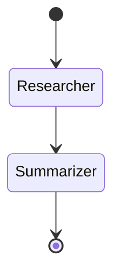
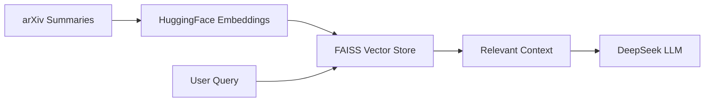

# 📚 AI Literature Review Assistant

> **An end-to-end AI-powered research assistant that automatically searches arXiv, builds persistent memory with RAG, and generates high-quality literature reviews using a multi-agent architecture.**

Built with **LangGraph**, **DeepSeek**, **FastAPI**, **Streamlit**, and **FAISS**, this project demonstrates how to design and deploy a **production-grade AI system** — not just a single LLM prompt.

---

## ⭐ Why This Project?

* 🔥 Modern **LangGraph-based multi-agent system** (AutoGen alternative)
* 🧠 **RAG with persistent memory** (FAISS + HuggingFace embeddings)
* ⚡ **Streaming LLM output**
* 🌐 **FastAPI backend + Streamlit frontend**
* 📄 **PDF export of literature reviews**
* 💸 **OpenAI-free stack** (DeepSeek + local embeddings)
* 🧩 Clean, modular, scalable architecture

> If you’re interested in **LLMs, agents, RAG, or AI systems engineering**, ⭐ this repository!

---

## 🧠 What Does It Do?

1. User enters a **research topic** (e.g., *LLMs*, *AutoGen*, *Mathematics*)
2. System automatically:

   * Searches arXiv for relevant papers
   * Stores paper summaries in a vector database (RAG memory)
   * Generates a structured literature review
3. Output is available as:

   * Markdown (UI)
   * Streaming text
   * Downloadable PDF

---

## 🏗️ System Architecture

### 🔹 High-Level Architecture

```mermaid
flowchart TD
    U[User Browser] --> S[Streamlit Frontend]
    S -->|HTTP| A[FastAPI Backend]

    A --> G[LangGraph Orchestrator]

    G --> R1[Researcher Agent]
    G --> R2[Summarizer Agent]

    R1 --> X[arXiv API]
    R1 --> M[RAG Memory<br/>(FAISS + HF Embeddings)]

    R2 --> M
    R2 --> L[DeepSeek LLM]

    A -->|Markdown / Stream| S
    A -->|PDF| U
```

---

### 🤖 LangGraph Agent Workflow



---

### 🧠 RAG Memory Flow



---

## 📁 Project Structure

```text
ArxivPaperFinder/
│
├── backend/
│   ├── api.py          # FastAPI routes (review, stream, download)
│   ├── graph.py        # LangGraph multi-agent orchestration
│   ├── rag.py          # RAG memory (FAISS + embeddings)
│   └── __init__.py
│
├── frontend/
│   └── app.py          # Streamlit UI
│
├── data/               # Persistent vector storage (create once)
│   └── vectorstore/
│
├── requirements.txt
├── .env
└── README.md
```

---

## ⚙️ Tech Stack

| Layer               | Technology                       |
| ------------------- | -------------------------------- |
| LLM                 | DeepSeek (`deepseek-chat`)       |
| Agent Orchestration | LangGraph                        |
| Backend API         | FastAPI                          |
| Frontend            | Streamlit                        |
| Vector Store        | FAISS                            |
| Embeddings          | HuggingFace (`all-MiniLM-L6-v2`) |
| Paper Source        | arXiv                            |
| PDF Export          | ReportLab                        |

---

## 🚀 How It Works (Step-by-Step)

1. **Frontend** collects topic & paper count
2. **FastAPI** receives request and builds task prompt
3. **LangGraph** starts agent workflow
4. **Researcher Agent**:

   * Extracts search query
   * Calls arXiv API
   * Stores summaries in vector memory
5. **Summarizer Agent**:

   * Retrieves relevant context from RAG
   * Generates structured literature review
6. Response returned as Markdown / Stream / PDF

---

## 🛠️ Installation & Setup

### 1️⃣ Clone Repository

```bash
git clone https://github.com/your-username/ArxivPaperFinder.git
cd ArxivPaperFinder
```

---

### 2️⃣ Create Virtual Environment

```bash
python -m venv venv
venv\Scripts\activate   # Windows
# source venv/bin/activate  # Linux / macOS
```

---

### 3️⃣ Install Dependencies

```bash
pip install -r requirements.txt
```

> ⏳ First run downloads a HuggingFace embedding model (~90MB)

---

### 4️⃣ Environment Variables

Create `.env` in project root:

```env
DEEPSEEK_API_KEY=sk-xxxxxxxxxxxxxxxx
```

✔ No `OPENAI_API_KEY` required

---

## ▶️ Running the Project

### Start Backend (FastAPI)

```bash
uvicorn backend.api:app --reload
```

Backend runs at:

```
http://127.0.0.1:8000
```

---

### Start Frontend (Streamlit)

```bash
streamlit run frontend/app.py
```

Frontend runs at:

```
http://localhost:8501
```

---

## 🌐 API Endpoints

| Endpoint    | Description                     |
| ----------- | ------------------------------- |
| `/review`   | Generate full literature review |
| `/stream`   | Stream output token-by-token    |
| `/download` | Download review as PDF          |

Example:

```
/review?topic=Autogen&papers=5
```

---

## 🎥 Demo & Screenshots

> *(Add images to `assets/` folder)*

### 🔍 Literature Review Generation


### ⚡ Streaming Output


### 📥 PDF Export


---

## 🧠 RAG Memory Details

* Uses **FAISS** for vector similarity search
* Uses **local HuggingFace embeddings** (no API key)
* Memory persists across runs
* Improves relevance and reduces hallucinations

> `data/vectorstore/` is auto-created on first run

---

## 🎯 Use Cases

* Academic literature review
* Research exploration
* AI/ML trend analysis
* Interview preparation
* Technical documentation

---

## 💼 Portfolio Description

> I built a LangGraph-based multi-agent research assistant that retrieves arXiv papers, stores knowledge in a vector database using RAG, and generates structured literature reviews. The system exposes a FastAPI backend with streaming output and PDF export, and a Streamlit frontend for interaction. It is fully OpenAI-independent and production-ready.

---

## 🧠 Engineering Highlights

* Explicit multi-agent orchestration (LangGraph)
* Tool-augmented LLM reasoning
* Persistent vector memory
* Async-first backend design
* Clean separation of concerns
* Easily extensible with new agents or tools

---

## 🔮 Future Enhancements

* 🔐 Authentication & rate limiting
* 📊 Paper relevance scoring
* 🧠 Multi-agent debate / reviewer loop
* ☁️ Docker & cloud deployment
* 📈 Usage analytics dashboard

---

## 👤 Author

**Suraj Nahak**
AI / ML Engineer | Backend & Systems Builder

---

⭐ *If you find this project useful, please consider starring the repository!*
